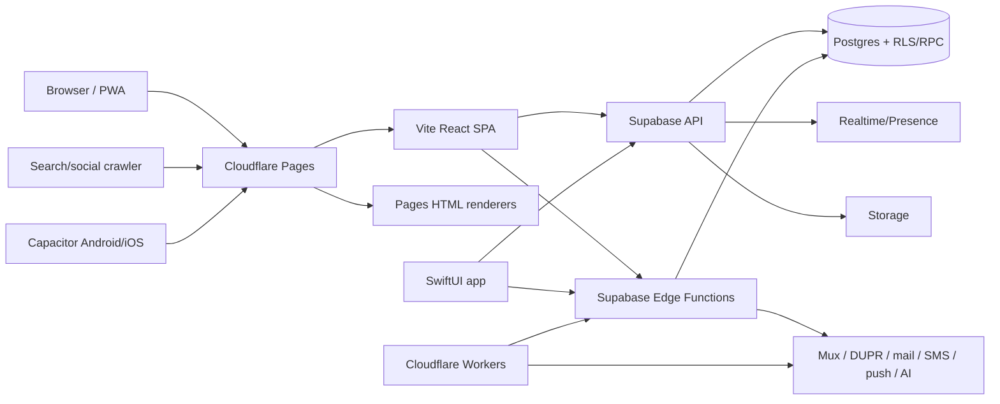
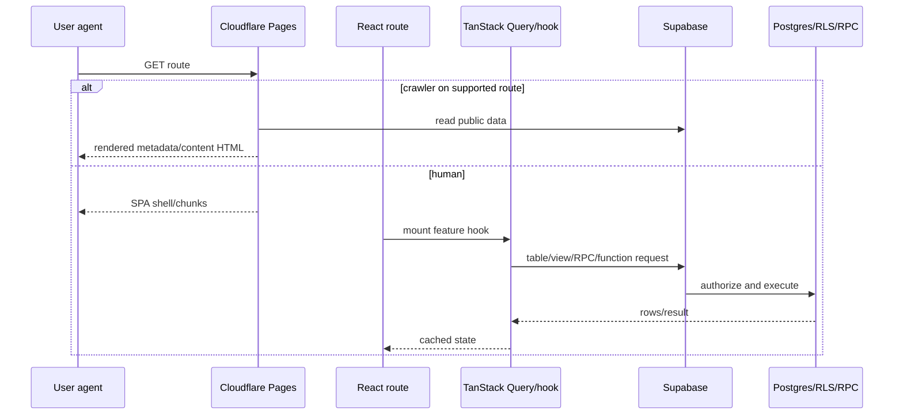

# Architecture overview

> Verified against the repository on 2026-08-26. Source paths are the authority; generated artifacts (`dist/`, bundled Capacitor assets, `graphify-out/`) are not architecture sources.

## Purpose and business goals

ThePickleHub is a bilingual (English/Vietnamese) pickleball platform. It combines public discovery and media (news, blog, livestreams, videos, venues, rankings), player identity/social features, club and social-event operations, tournament administration/scoring, and a closed-pilot shop. These goals are visible in the route catalog (`src/App.tsx`), database contract (`src/integrations/supabase/types.ts`), native feature tree (`apple/ThePickleHub/Features/`), and Edge Function inventory (`supabase/functions/auth-registry.json`).

## Major systems

| System | Responsibility | Primary sources |
|---|---|---|
| Web/PWA | Public site, authenticated tools, creator/admin consoles | `src/`, `vite.config.ts`, `src/pwa.ts` |
| Cloudflare Pages layer | SPA fallback, crawler-aware HTML, OG proxies, sitemaps/RSS | `functions/`, `public/_redirects`, `public/_headers` |
| Supabase | Postgres, Auth, RLS, RPC, Storage, Realtime, Edge Functions | `supabase/migrations/`, `supabase/functions/`, `supabase/config.toml` |
| Capacitor shell | Android/iOS WebView wrapper; current production config loads the hosted site remotely | `capacitor.config.ts`, `android/`, `ios/` |
| Native Apple app | SwiftUI client with domain repositories and direct Supabase REST/RPC | `apple/ThePickleHub/`, `apple/project.yml` |
| Workers | News acquisition, professional-tour scraping, social posting, edge watchdog | `workers/` |

## Technology stack and runtime

| Layer | Verified technology |
|---|---|
| Web | React 18, TypeScript 5.8, Vite 5, React Router 6, TanStack Query 5 |
| UI | Tailwind 3, shadcn/Radix primitives, Lucide, `next-themes`, project-wide The Line tokens |
| Forms | React Hook Form, Zod, `@hookform/resolvers` |
| Backend | Supabase/Postgres; Deno TypeScript Edge Functions |
| Video | Mux live/video, Mux Player, HLS.js |
| Native | Capacitor 8 plus a separate SwiftUI application |
| Edge hosting | Cloudflare Pages Functions and Cloudflare Workers |
| Tests | Vitest, Testing Library, Playwright, XCTest/Swift tests |

Package versions and commands are in `package.json`; native plugins are in `capacitor.config.ts`; Supabase project/function configuration is in `supabase/config.toml`.

## Deployment model

The web build produces a static Vite/PWA artifact. Cloudflare Pages serves it and runs `functions/_middleware.ts`, which selects crawler-rendered HTML for supported routes while normal users receive the SPA. Supabase is a separately deployed managed backend. Edge Functions deploy independently under the project id in `supabase/config.toml`. `workers/*/wrangler.toml` defines independent Cloudflare Workers. Although Capacitor's `webDir` is `dist`, the checked-in production configuration sets `server.url=https://www.thepicklehub.net`; the wrapper's normal entry point is therefore the hosted site. Local bundles are synchronization artifacts, but the checked-in configuration does not establish them as an automatic offline fallback. `apple/` is a separate native SwiftUI target.

## Application lifecycle

1. `src/main.tsx` loads global styles, initializes client-error and Web Vitals reporting, mounts `<App>`, then registers the PWA outside development/Capacitor.
2. Module evaluation in `src/App.tsx` initializes native Google auth, constructs one `QueryClient`, optionally prefetches home data, and preloads the critical route chunk.
3. Providers mount in this order: Query Client → theme → i18n → auth → tooltip → confirmation → router (`src/App.tsx:613`). Toasters and the offline banner are inside confirmation but outside the router.
4. `AppEffects` handles deep links, analytics, livestream attribution, push, and notification realtime; `AppChrome` renders header/nav/chat around lazy routes.
5. Auth state is sourced from Supabase `onAuthStateChange`; sign-out clears query and auth-sensitive PWA caches (`src/hooks/useAuth.tsx`).

## Repository layout

| Path | Purpose |
|---|---|
| `src/pages/` | Route-level web screens |
| `src/components/` | Feature and shared UI |
| `src/hooks/` | Queries, mutations, contexts, feature orchestration |
| `src/lib/` | Pure algorithms, integrations helpers, policies |
| `src/integrations/supabase/` | Browser Supabase clients and generated DB types |
| `supabase/migrations/` | Canonical schema/RLS/RPC history |
| `supabase/functions/` | Deno Edge Functions and shared server utilities |
| `functions/` | Cloudflare Pages middleware, HTML renderers, OG/sitemap endpoints |
| `workers/` | Standalone Cloudflare Workers |
| `apple/` | Native SwiftUI app |
| `android/`, `ios/` | Capacitor projects/artifacts; Android is minimal in this snapshot and iOS contains an older synchronized web bundle |
| `tests/` | Playwright end-to-end suites |
| `docs/` | Product, operational, audit, and architecture records |

## Request lifecycle

## Data lifecycle

Public reads generally use explicitly public tables or curated views through the anon browser client. Authenticated reads/writes carry the Supabase session and are constrained by RLS. One notable exception is the owner/definer `public_livestreams` view, whose fixed column projection—not base-table RLS—is its public boundary. Multi-row or concurrency-sensitive mutations use Postgres RPCs with locks/version columns (notably tournament scoring). Privileged operations and third-party secrets stay in Edge Functions/Workers. TanStack Query caches server state and is invalidated after mutations; Realtime channels update live/chat/notification surfaces. Telemetry is batched into bounded database tables. See `src/integrations/supabase/client.ts`, tournament hooks, `_shared/auth.ts`, and `supabase/functions/auth-registry.json`.

## Additional cross-layer subsystems

| Subsystem | Verified surfaces |
|---|---|
| News/editorial/feed | `workers/news-fetcher`, `news-*` Edge Functions, `news_origins`/`news_items`, social-poster Worker, Pages renderer/sitemap, React and Swift feed readers |
| Operations | client error/Web Vitals ingress, `ops_cron_*` and job RPCs, health/digest Edge Functions, Telegram/GitHub dispatch, `/admin/jobs` |
| Shop | React seller onboarding/bulk import, pilot/application migrations, a broader SwiftUI buyer/cart/order client, and unresolved backend-contract drift described in `04_database.md` |
| SEO/prerender | Pages middleware/render modules, React metadata, OG functions/proxies, sitemap/RSS endpoints and route parity tests |
