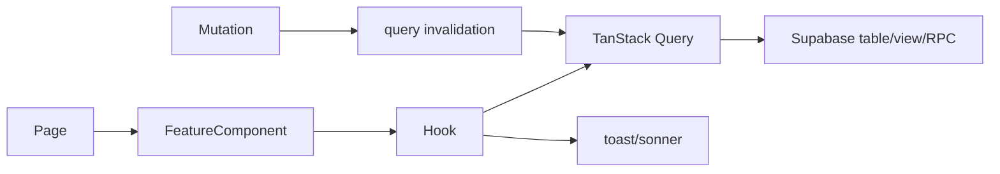

# Frontend architecture

## Routing and rendering

`src/App.tsx` is the route composition root. Almost every page is loaded through `lazyRetry`, which retries a failed dynamic import once after 1.5 seconds. `ChunkErrorBoundary` clears stale service-worker caches and caps reload attempts. `mirroredRoutes` creates English and `/vi` twins; irregular Vietnamese legacy routes and redirects are explicit. Route parity is guarded by `src/routes/__tests__/route-snapshot.test.ts` and `route-snapshot.json`.

Rendering is client-side React. Cloudflare Pages middleware supplies crawler-oriented HTML separately (`functions/_middleware.ts`, `functions/_lib/render/`). The SPA eagerly imports only its shell and preloads route chunks for `/`, blog posts, and venue detail based on `window.location.pathname`.

Route classes:

| Class | Examples | Guard |
|---|---|---|
| Public discovery | `/`, `/live`, `/videos`, `/tournaments`, `/social`, `/san` | none |
| Identity/social | `/account`, `/messages`, match creation | `RequireAuth` where required |
| Tournament tools | `/tools/quick-tables`, team match, doubles elimination, flex | mixed public view/owner-referee writes |
| Creator | `/creator/*` | no central route wrapper; checked-in creator pages use `CreatorLayout`, which checks creator/admin and organization |
| Admin | `/admin/*` | most pages enforce admin + MFA in `AdminLayout`; `/admin/dupr`, `/admin/errors`, and shop review routes use explicit `RequireAuth` |
| Shop pilot | `/shop/sell`, `/seller/*`, admin review | login in router; server RPC/RLS is authoritative |
| Embeds | `/embed/live/:id`, `/embed/video/:id` | stripped-down public screens |

## Providers and contexts

| Provider/context | Responsibility | File |
|---|---|---|
| `QueryClientProvider` | Remote-state cache/default retry policy | `src/App.tsx` |
| `ThemeProvider` | Fixed dark theme compatibility | `src/App.tsx` |
| `I18nProvider` | English/Vietnamese dictionary and route language | `src/i18n/index.tsx` |
| `AuthProvider` | Supabase user/session lifecycle | `src/hooks/useAuth.tsx` |
| `TooltipProvider` | Radix tooltip scope | `src/App.tsx` |
| `ConfirmProvider` | Promise-based confirmation dialog | `src/hooks/useConfirm.tsx` |

Actual nesting is Query Client → Theme → I18n → Auth → Tooltip → Confirm → Router. There is no global Redux-style store. Context is limited to cross-cutting session/UI concerns; remote domain state lives in TanStack Query, and transient form/dialog state is local React state.

## React organization and data flow

Pages compose feature components and hooks. Hooks usually own Supabase queries/mutations and return typed data plus pending/error state. Mutation hooks invalidate stable query-key families. Pure scheduling/seeding algorithms live in `src/lib/`; transactional validation and authoritative state changes live in RPCs. Typical flow:

Large domains are grouped consistently: `pages/X.tsx`, `components/x/`, `hooks/useX*.ts`, `lib/x/`, then matching tables/RPCs. Examples are quick tables, team match, flex, social events, and shop.

## Shared UI and styling

`src/components/ui/` contains shadcn/Radix primitives. Cross-page shell components are in `components/layout/`; loading/empty/error/offline states are in `components/states/PageStates.tsx`; SEO primitives are in `components/seo/`; share/report/auth components are shared by feature areas.

Tailwind utilities are configured by `tailwind.config.ts`. `src/index.css` supplies base variables; `src/styles/the-line.css` is imported globally and wins through `:root[data-theme="the-line"]`. Components commonly use `cn()` (`src/lib/utils.ts`) and CSS custom properties such as `--tl-*`. `class-variance-authority` defines variants in reusable primitives.

## State, forms, and validation

- Server state: TanStack Query; global defaults are 30-second stale time, five-minute GC, no focus/mount refetch, bounded retry (`src/App.tsx`).
- Session: `AuthProvider`; sign-out purges all query data.
- Local UI: `useState`, `useMemo`, `useCallback`; dialogs/sheets own their open/edit state.
- Forms: both controlled forms and React Hook Form exist. Zod is used where schemas are defined; several legacy forms validate imperatively.
- Notifications: the legacy and social notification sources are unified by `src/hooks/social/useUnifiedNotifications.ts`.

## Realtime and lazy loading

Realtime hooks subscribe to Supabase channels for chat, live presence, notifications, and selected event/tournament updates; each hook owns unsubscribe cleanup. Page-level splitting is universal. Heavy subdialogs on `TeamMatchView` and home video playback are additionally lazy. The shop prototype is compile-time excluded unless `VITE_PROTO_SHOP=1` (`src/App.tsx`, `vite.config.ts`).

## Web/mobile differences

`Capacitor.isNativePlatform()` gates PWA registration and native behavior. Deep links, push notifications, browser OAuth, status bar, splash screen, and social login are wrapped by hooks (`useDeepLinkHandler`, `usePushNotifications`, `useNativeGoogleAuth`). The current Capacitor production config is a remote WebView wrapper for `www.thepicklehub.net`, so a web deployment can affect it without an app binary update. The `apple/` SwiftUI application is separate and does not render React; it mirrors backend contracts through Swift repositories.

## Patterns that must be preserved

- Keep EN/VI route and crawler-renderer parity when adding public routes.
- Do not replace atomic scoring/lifecycle RPCs with direct multi-row client updates.
- Treat frontend guards as UX only; server RLS/RPC/Edge auth is authoritative.
- Use generated `Tables<>`, `Enums<>`, and RPC argument types from `src/integrations/supabase/types.ts`.
- Invalidate the same query-key families used by readers after mutations.
