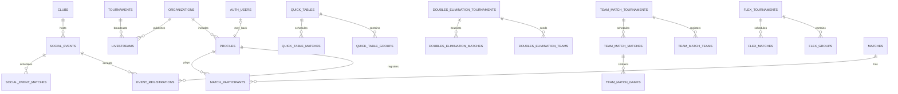

# Database knowledge guide

## Source of truth

Use `supabase/migrations/` to understand repository-defined behavior and `src/integrations/supabase/types.ts` for the last remote-generated TypeScript shape. Neither alone proves production state: later migrations replace earlier definitions, and locally present migrations can be intentionally unapplied. Always inspect the latest definition with `rg "CREATE OR REPLACE FUNCTION public.<name>" supabase/migrations`. The generated type currently exposes exactly 130 public tables, five views, 201 RPC entries and 26 enums.

## Business entity catalog

| Domain | Important tables | Ownership/relationships and lifecycle |
|---|---|---|
| Identity/access | `profiles`, `user_roles`, `organizations`, `api_keys`, `audit_logs` | Real-user profiles normally use `auth.users.id`, but `profiles` also stores `is_ghost=true` guest/pro-tour/placeholders without auth accounts. Roles key real users. |
| Content/media | `livestreams`, `videos`, `comments`, `likes`, `view_events`, `view_counts`, `clips` | content belongs to an organization/tournament; interactions point to target type/id. |
| Chat/moderation | `chat_messages`, `chat_message_likes`, `chat_mutes`, `chat_pinned_messages`, `chat_room_settings`, `content_reports`, `blocked_users` | livestream-scoped chat; moderator capability is RPC-derived. |
| Core tournaments | `tournaments`, `parent_tournaments` | public tournament directory and aggregation/container records. |
| Quick table | `quick_tables`, `quick_table_groups`, `quick_table_players`, `quick_table_teams`, `quick_table_matches`, `quick_table_registrations`, `quick_table_referees`, invitations/requests | table owns groups/players/teams/matches; status setup → group stage → playoff → completed. |
| Team match | `team_match_tournaments`, `team_match_game_templates`, `team_match_groups`, `team_match_teams`, `team_match_roster`, `team_match_matches`, `team_match_games`, `team_match_referees`, `master_teams`, `master_team_roster` | tournament owns templates/groups/registered teams/matches; match owns individual games. |
| Doubles elimination | `doubles_elimination_tournaments`, `doubles_elimination_teams`, `doubles_elimination_matches`, `doubles_elimination_referees` | tournament owns entrants and directed bracket nodes. |
| Flex | `flex_tournaments`, `flex_players`, `flex_teams`, `flex_team_members`, `flex_groups`, `flex_group_items`, `flex_matches`, `flex_player_stats`, `flex_pair_stats`, `flex_tournament_referees` | flexible entities/groups; parent/child matches and materialized stats. |
| Social play | `matches`, `match_participants`, `match_proposals`, proposal invitations/verifications, `kudos`, `follows`, `social_follows`, `social_comments`, `social_notifications` | user-created or proposed matches; participant confirmation and DUPR submission state. |
| Clubs/events | `clubs`, `club_managers`, `club_members`, `social_events`, `event_registrations`, `registration_secrets`, `social_event_matches`, `event_payment_config`, `payment_orders`, OTP/recovery tables | club owns events; event owns registrations/matches/payment config; guest control is capability-token based. |
| Messaging | `conversations`, `conversation_participants`, `messages` | participants gate direct-message conversation access. |
| Discovery | `venues`, `open_play_sessions`, `session_participants`, `play_requests`, `leaderboard_snapshots` | public venue/session discovery with user participation. |
| DUPR | `dupr_user_tokens`, `dupr_partner_tokens`, `dupr_user_clubs`, entitlements, sync runs, webhooks, submissions, rating history | encrypted credentials and synchronized external identity/rating state. |
| News/blog | `news_origins`, `news_items`, `news_sources`, `vi_blog_posts`, blog view tables, `feed_embeds`, `feed_highlights`, `fb_post_log`, newsletter tables | ingest → translate/rewrite → publish → distribute lifecycle. |
| Operations | `client_errors`, rate-limit tables, `presence_heartbeats`, `ops_cron_*`, `ops_job_*`, `error_alert_dedup`, `secret_sync_log`, `telegram_commands` | bounded telemetry, job dispatch/health, alert deduplication. |
| Shop pilot (migration present, generated type absent) | `shop_pilot_members`, `shops`, `shop_members`, `shop_applications`, `shop_application_events`, `my_shop_application` view | user application → submit/review → active shop. `shop-schema.ts` explicitly says `20260811090000` is not applied to the remote schema used for type generation. |
| Shop product/import clients (contract incomplete) | callers name `products`, `shop_cart_items`, `shop_orders`, `shop_order_items`; storage names `shop-product-media-draft`/`shop-product-media` | `20260824120000` alters `products` but the base `products` migration named in its comment (`20260811120000`) is absent. No included migration defines the cart/order tables, public shop RPCs or media buckets used by Swift/React clients. |

## Relationship map

## Constraints and ownership

- Foreign keys generally cascade child tournament rows; confirm the relevant migration before deletion.
- Unique partial indexes prevent duplicate active event registrations by profile/phone, active DUPR account reuse, open shop applications, duplicate playoff nodes, and replayed webhook/news/social records.
- Status columns use Postgres enums or text `CHECK` constraints. Application unions mirror them but do not replace DB enforcement.
- Owner/referee/admin checks are encoded in RLS helper functions (`is_*`, `can_edit_*`) and atomic RPCs.
- Guest event registrations never rely on caller-supplied ownership; server-only `registration_secrets` maps magic tokens to registrations.
- Optimistic concurrency uses `score_version` in quick-table, flex, team-match, and doubles-elimination scoring.
- Ghost profiles are first-class participant identities. Walk-in/OTP/pro-tour/invitation paths create them; `merge_my_ghost_by_phone` and service-only `merge_ghost_into_profile` re-point references into a verified real profile and delete the ghost. Do not inner-join every profile to `auth.users`.

## Generated-schema inventory

The 130 generated tables break down into identity/access, content/chat, four tournament families, social/matches, clubs/events/payment, messaging, DUPR, news/feed, operations and public discovery. The five generated views are `club_listing`, `club_stats`, `player_stats`, `public_livestreams`, and `public_profiles`. Shop tables are absent from this generated contract and are hand-modeled in `src/integrations/supabase/shop-schema.ts`; do not silently add them to `Database` assumptions.

### Verified unresolved schema references

| Caller | Referenced object | Included definition |
|---|---|---|
| `supabase/functions/product-import-enrich/index.ts` | `rate_limits` | none; inserts/counts are not backed by included schema |
| `src/hooks/shop/useBulkProductImport.ts` | `products`, `product_media_init`, `product_media_finalize`, `shop-product-media-draft` | only an ALTER migration for `products`; no base table/RPC/bucket migration |
| `apple/ThePickleHub/Core/Shop/SupabaseShopPublicAPI.swift` | `shop_public_search`, `shop_public_categories`, `shop_public_product`, `shop_public_shop` | none |
| Swift cart/order repositories | `shop_cart_items`, `shop_orders`, `shop_order_items`, `shop_cart_view`, `shop_order_*` | none |
| Swift shop image DTOs | public bucket `shop-product-media` | none |

This table documents repository consistency only. The objects may exist in an external/remote schema, but that cannot be verified from this repository and must not be assumed by future agents.

## Important indexes

High-value index families verified in migrations include:

| Workload | Index examples/source |
|---|---|
| Chat timeline/idempotency | `(livestream_id, created_at desc)`, user timeline, unique client message ID (`20251222092727*`, `20251222101820*`) |
| Quick-table lookup/bracket uniqueness | table/group/player FKs and unique playoff match (`20251223034604*`, `20251224073113*`) |
| Tournament children | team/flex/doubles tournament and group FKs (`20260108*`, `20260123142717*`) |
| Social discovery | profile username/DUPR/city; venue city/slug/geo; match date/venue/tournament (`20260503131017*`) |
| Events/registration | event status/start, event/profile and event/phone unique partials, payment-pending (`20260511120000*`, `20260513140000*`) |
| News/feed | language/status/publish time, source URL uniqueness, translation/editorial queues (`20260519*`, `20260731*`) |
| Telemetry/ops | error time/type/user, presence last seen, cron/job state/time (`20260527120000*`, `20260802*`) |
| Shop | owner/state, member user, application queue/open uniqueness, product import batch (`20260811*`, `20260824120000*`) |

## Important/frequent queries

- Public home/live lists query `public_livestreams`, videos, news and stats with time/status ordering (`src/hooks/useLivestreamData.ts`, `src/lib/prefetch.ts`).
- Tournament views fetch one root row plus separately cached children, ordered by round/display/seed (`useQuickTable*`, `useTeamMatch*`, `useDoublesElimination`, `useFlexTournament`).
- Feed/profile ranking uses RPC read models (`get_feed_timeline`, `get_following_feed`, `get_public_profile`, leaderboard functions).
- Creator/admin analytics use organization-scoped aggregation RPCs; do not reproduce them with broad client reads.

Frequently updated tables are chat/presence/view telemetry, notifications, match/game score rows, event registrations/payments, news pipeline rows, and ops dispatch/run state. These require narrow filters, correct indexes, bounded realtime subscriptions, and idempotent writes.

## Views

`public_livestreams`, `public_profiles`, `club_listing`, `club_stats`, and `player_stats` are important public read models exposed in generated types. Treat nullable view columns as nullable even when their base table is stricter (`src/hooks/useLivestreamData.ts`, `src/pages/WatchLive.tsx`). The latest `public_livestreams` definition is an owner/definer view which bypasses base `livestreams` RLS; its explicit public projection omits `mux_stream_key` and internal Mux live-stream ID (`20260218031231_4d223ff8-f1aa-44e7-8607-c3c9d7523de3.sql`).

## Storage buckets

| Bucket | Verified policy/use source |
|---|---|
| `avatars` | public read; user-folder owner writes (`20260112073626*`, Swift profile repository) |
| `videos` | public media with creator organization-folder policies, later admin bypass fix (`20251222113744*`, `20260428000001*`) |
| `thumbnails` | public read and authenticated creator write policies (`20251222132621*`) |
| `og-images` | public read; authenticated write policies (`20260415000001*`) |
| `clubs-logos` | public read, self-service club folder writes and limits (`20260512160000*`, `20260512160200*`) |
| `forum-images` | public read; authenticated upload and owner-folder delete (`20260227041508*`) |
| shop media bucket names | referenced by clients but not defined by included migrations |
