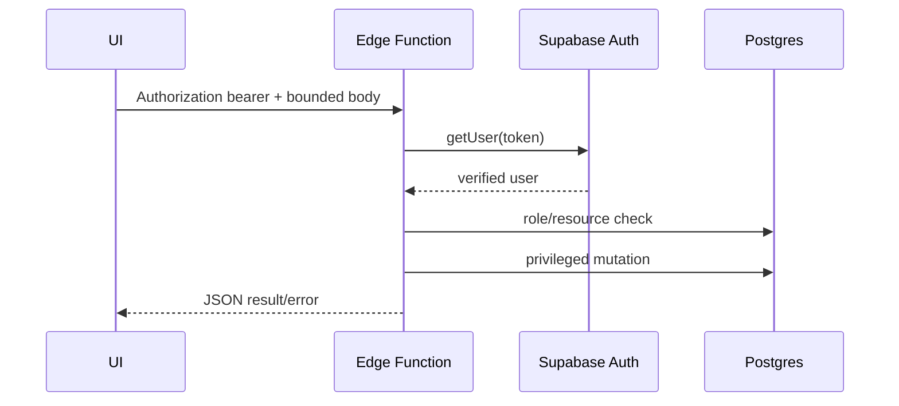
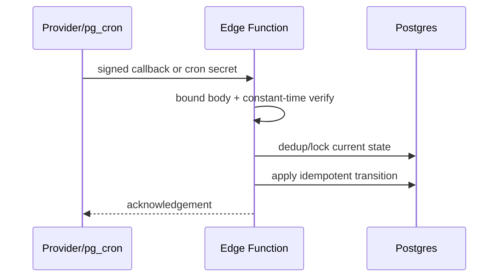

# Edge Function catalog

## How to read this catalog

This inventory covers all 81 functions classified by `supabase/functions/auth-registry.json` on 2026-08-26. Each handler is `supabase/functions/<name>/index.ts`; configuration is in `supabase/config.toml`. “User JWT” means the handler verifies it internally. “Service DB” means a service-role client bypasses RLS only after the stated request authorization. Exact request schemas and status codes remain in each handler. A name appearing here does not imply implementation completeness: `leaderboard-compute` and `notification-send` are authenticated skeletons.

The registry flow grammar is `actor.operation.credential.authorization`. Its `flows` entry is the definitive compact statement of authentication. Common outputs are JSON success/error objects; OG functions return PNG/image responses; webhook/email callbacks return provider-compatible HTTP responses.

## Registration, payment, identity

| Function | Purpose; inputs → outputs | Auth / caller | Data and external APIs; failures/security |
|---|---|---|---|
| `add-registration-direct` | Add an event registration from magic token or organizer request → registration result | magic token or user JWT + resource scope; registration UI/organizer | registrations/secrets; rejects invalid scope, duplicates, capacity/validation errors |
| `cancel-registration` | Cancel registration by token → updated state | magic token; recovery page | registrations/secrets/payment state; invalid/expired token or illegal state |
| `reactivate-registration` | Restore eligible cancelled registration → state | magic token; recovery page | registrations/secrets; capacity and lifecycle races fail closed |
| `create-payment-order` | Create event prepayment order → order/payment instructions | magic token; registration UI | payment config/orders; invalid registration/config/duplicate order |
| `mark-payment-claimed` | Mark player claim → payment state | magic token | payment orders/registrations; token/state validation |
| `auto-cancel-unpaid-registrations` | Expire overdue unpaid entries → counts | cron secret; pg_cron/ops | registration/payment tables; Vault-backed cron auth, retry-safe sweeps |
| `phone-otp-send` | Issue registration OTP → delivery/dev result | Turnstile/human challenge; public form | OTP/send logs; Zalo ZNS then eSMS fallback; rate/gateway/config failures |
| `phone-otp-verify` | Verify one-time code → registration capability/result | OTP code; public form | OTP/secrets/registrations; expiry, replay, attempts, capacity |
| `request-recovery-link` | Find registrations and send recovery link → redacted delivery result | public, optionally Turnstile | recovery attempts, profile/registration lookup; Zalo/email fallback; enumeration controls |
| `send-event-registration-email` | Internal registration email → provider status | mandatory internal notify secret | Resend; missing config returns 503, provider failures surfaced |
| `delete-account` | Delete current account/data → completion result | verified user JWT | Auth admin/service DB; identity derived from JWT, partial cleanup errors |
| `send-auth-email` | Supabase auth-hook email delivery → hook response | signed webhook | Resend; signature/config/provider failures |

## Match, invitation, tournament operations

| Function | Purpose; inputs → outputs | Auth / caller | Data/external; failures/security |
|---|---|---|---|
| `invite-team-to-tournament` | Resolve captain email/master team, create an **approved** tournament team, copy its master roster as confirmed, then best-effort email → created team | user JWT; exact tournament `created_by` owner; team-management UI/native repository | service DB + Resend; profile/team/duplicate/insert errors abort; roster-copy and email failures do not roll back the created team |
| `match-create` | Create social match → match/invites | user JWT, derived actor | matches/participants; validation and duplicate conflicts |
| `match-confirm` | Confirm participant result → state | user JWT + match scope | match participants; nonparticipant/terminal-state rejection |
| `match-invite-redeem` | Redeem invitation code → participant state | user JWT | invitations/matches; invalid, consumed, mismatched invitations |
| `match-proposal` | Create/respond to proposal → proposal state | user JWT | proposal/invitation tables; actor and state checks |
| `match-expire` | Expire stale pending matches → counts | cron secret | matches/proposals; bounded idempotent sweep |
| `submit-match-score` | Submit social-event score → match state | magic token or admin JWT | event matches/registrations; participant/admin scope, score validation |
| `auto-archive-tournaments` | Archive eligible ended tournaments → counts | cron secret | tournament families; lifecycle/date checks |

## Mux, media, chat-adjacent

| Function | Purpose; inputs → outputs | Auth / caller | Data/external; failures/security |
|---|---|---|---|
| `mux-create-livestream` | Create Mux live stream from title/policy → live ID, playback ID, stream key | creator/admin JWT + role check; creator form | Mux API; role, credential, provider/body errors; stream key is secret |
| `mux-webhook` | Handle `video.asset.ready` (fill empty replay asset) and `video.live_stream.idle` (live→ended) → acknowledgement | Mux HMAC/timestamp signature | livestreams; does **not** mark a stream live; fill-only asset update protects manual replacements |
| `mux-sync-assets` | Reconcile ended/recent streams; retain a ready stored asset or choose the longest ready recent Mux asset → per-stream results | cron secret | livestreams + Mux API; seven-day repair window, provider/missing-ready-asset failures |
| `video-thumbnail-proxy` | Retrieve/normalize creator video thumbnail → image/blob | creator/admin JWT | remote thumbnail provider; URL allowlist/content/size/provider errors |
| `batch-view-events` | Validate and atomically ingest bounded view batch → accepted counts | anonymous or optional verified user | view/rate-limit tables; IDs and replay state derived server-side |
| `log-client-event` | Ingest bounded CSP/JS/Web Vitals event → accepted | anonymous or optional verified user | client errors/rate-limit tables; payload/cardinality/rate/retention controls |
| `geo-check` | Read geo-block settings, derive client IP, query country and return `{country, blocked}` | public | service DB + plaintext HTTP call to `ip-api.com`; invalid/missing IP becomes `unknown`; internal failure returns 500 with `blocked:false` |

## DUPR

| Function | Purpose | Auth/caller | Access, APIs, failure modes |
|---|---|---|---|
| `dupr-link` | Link user DUPR identity | user JWT | DUPR API + encrypted token/profile rows; identity/conflict/provider errors |
| `dupr-disconnect` | Revoke/unlink current user | user JWT | token/entitlement tables + DUPR as applicable |
| `dupr-refresh-user-token` | Refresh linked token | user JWT | DUPR OAuth; expired refresh/crypto/provider failure |
| `dupr-sso-callback` | Complete authenticated SSO callback | user JWT callback | code exchange/token encryption; state/code mismatch |
| `dupr-sync` | Refresh stale DUPR profiles | cron secret | profiles/tokens/history + DUPR; rate/token/provider failures |
| `dupr-clubs` | Read/sync current user's DUPR clubs | user JWT | DUPR and club cache |
| `dupr-entitlements` | Read/sync current entitlements | user JWT | DUPR entitlement cache |
| `dupr-event-eligibility` | Evaluate player/event eligibility | user JWT | registrations/event config/DUPR profile |
| `dupr-user-search` | Search DUPR users | user JWT | DUPR; bounded query/provider errors |
| `dupr-match-submit` | Submit eligible internal match to DUPR | user JWT + resource scope, or admin | matches/submissions + DUPR; eligibility/idempotency/provider errors |
| `dupr-org-link-club` | Link organization to DUPR club | scoped user or admin | organizations/DUPR clubs |
| `dupr-org-unlink-club` | Remove organization link | scoped user or admin | organizations; ownership check |
| `dupr-partner-token` | Supply partner service token | service-role bearer | DUPR partner token store/API; never public |
| `dupr-token-backfill` | Internal token migration/backfill | service-role bearer | encrypted token rows; crypto/version failures |
| `dupr-webhook` | Health GET or process signed-secret DUPR callback | public health; callback payload `CLIENT_KEY` | webhook dedup + DUPR tables; bounded/redacted/idempotent |
| `dupr-webhook-register` | Register webhook | service-role bearer | DUPR webhook API |
| `dupr-webhook-test-fire` | Test callback path | user JWT or service bearer | webhook test data/DUPR; nonproduction/actor constraints |

## News, feed, email, social distribution

| Function | Purpose | Auth/caller | Access, APIs, failure modes |
|---|---|---|---|
| `news-check` | Check candidate URL/content existence | permissioned API key or service bearer; news worker | news tables; scope and lookup errors |
| `news-ingest` | Insert normalized source items | permissioned API key or service bearer | origins/items/sources; schema, duplicate, attribution errors |
| `news-translate` | Claim and translate pending items | health GET; cron/service POST | news rows + Gemini; claim locks, validation/provider failures |
| `news-rewrite` | Claim, validate and publish rewritten news | health GET; admin+AAL, cron, or service POST | news pipeline + Gemini; retry policy and strict output validation |
| `feed-generate` | Generate feed candidates/highlights | health GET; cron/service POST | feed/social/tournament aggregates; bounded batch failure |
| `feed-embeds-sync` | Synchronize configured feed embeds | health GET; cron/service POST | embed sources + remote pages; validation/provider failures |
| `social-caption` | Generate social caption | internal shared secret | Gemini; bounded prompt/output and provider failures |
| `news-social-caption` | Deployment alias of `social-caption` | internal shared secret | same handler/security behavior |
| `send-blog-blast` | Send published blog campaign | webhook/shared secret | blog/newsletter + Mailchimp/email; signature/provider failures |
| `newsletter-subscribe` | Add anonymous subscriber → generic result | public | subscriber/rate-limit tables + Mailchimp where configured; anti-enumeration/rate controls |

## Push, operations and APIs

| Function | Purpose | Auth/caller | Access, APIs, failure modes |
|---|---|---|---|
| `send-push-notification` | Send targeted/broadcast push | admin JWT or service bearer | push tokens + FCM; stale tokens/provider failures |
| `notification-send` | Reserved no-op notification boundary | service bearer | no mutation; POST-only fail-closed skeleton |
| `leaderboard-compute` | Return `{status:"skeleton"}` only; planned leaderboard computation is not implemented | cron secret | no database read/write in current handler |
| `errors-telegram-alert` | Send deduplicated error alerts | cron secret | client errors/dedup + Telegram |
| `ops-edge-health` | Probe edge endpoints and record health | cron secret | ops state + HTTP endpoints; timeout/status failures |
| `ops-job-control` | Dispatch/retry/cancel controlled jobs | cron secret | ops job/cron tables + workers/functions; state-machine checks |
| `ops-job-digest` | Aggregate job health to digest | cron secret | ops tables + Telegram |
| `zalo-token-refresh` | Refresh OA token | cron secret | token table + Zalo OAuth; rotation/provider errors |
| `api-keys-generate` | Internal API key issuance | service bearer | hashed `api_keys`; secret shown only at creation |
| `api-keys-revoke` | Internal key revocation | service bearer | `api_keys`; unknown/already-revoked handling |
| `api-keys-list` | List redacted keys | admin JWT | `api_keys`; role check |
| `api-keys-admin-generate` | Admin key creation | admin JWT | `api_keys` + audit log |
| `api-keys-admin-revoke` | Admin key revocation | admin JWT | `api_keys` + audit log |
| `pro-tour-ingest` | Ingest signed scraper payload | service bearer; pro-tour Worker | pro-tour/watchlist/log tables; schema/idempotency checks |
| `pro-tour-trigger-scrape` | Ask scraper Worker to run | admin JWT | signed Worker HTTP call; admin/provider failure |
| `product-import-enrich` | Enrich one product name and discover matching public product images | user JWT, derived actor | Gemini + grounded search + bounded HTTPS page fetches; currently references missing `rate_limits`, ignores those query/insert errors, and does not itself verify shop-pilot membership |

## Public OG/image functions

All are unauthenticated reads intended for crawlers/share previews. They read only the named public entity with a service DB client and return an image or not-found/error response. Inputs are route/query identifiers; outputs must be cacheable but must not leak private rows.

| Functions | Entity/caller |
|---|---|
| `og-live`, `og-video`, `og-tournament`, `og-organization` | livestream, video, tournament, organization share/crawler endpoints |
| `og-quick-table`, `og-flex-tournament`, `og-doubles-elimination` | tournament-tool share pages |
| `og-image-match`, `og-image-player`, `og-image-social-event`, `og-image-club` | social match/player/event/club; Cloudflare PNG proxies in `functions/og/` add cache behavior |

## Sequences

### Authenticated user function



### Webhook/cron function



### Mux lifecycle

```mermaid
sequenceDiagram
  participant C as Creator
  participant MCF as mux-create-livestream
  participant M as Mux
  participant DB as livestreams
  participant WH as mux-webhook/sync
  C->>MCF: title + user JWT
  MCF->>M: create live stream
  M-->>MCF: live/playback IDs + stream key
  C->>DB: save scheduled livestream metadata
  M->>WH: signed idle/asset-ready events
  WH->>DB: live→ended; fill empty replay asset ID
```

## Cross-cutting failure and security rules

- `verify_jwt=false` never means “trusted”; consult `auth-registry.json` and the handler's first authorization branch.
- Service-role clients bypass RLS. They may only be created/used after caller identity, role, signature, shared secret, magic token, or human challenge is established.
- Public endpoints must bound body size, fields, batch size, rate, and output; telemetry/newsletter/OTP handlers add database-backed limits.
- Webhooks must verify provider authenticity before parsing sensitive fields and must be replay-safe.
- Never log bearer tokens, Mux stream keys, OTPs, magic tokens, API keys, or DUPR encrypted credentials.

## Verified direct callers

The principal in-repository caller classes are:

- React hooks/pages call registration/payment, match, DUPR, Mux creation, telemetry, recovery, admin, push, geo and product enrichment handlers.
- Swift repositories directly call registration/payment/social-score, account deletion, DUPR user search, team invitation and newsletter handlers.
- `workers/news-fetcher` calls `news-check`, `news-ingest` and rewrite flow; `workers/social-poster` calls caption/translation-related handlers; `workers/pro-tour-scraper` calls `pro-tour-ingest`; `workers/edge-blob-watchdog` probes selected money-path/edge endpoints and job control.
- Providers call `mux-webhook`, `dupr-webhook`, and the signed auth-email hook. Cron/ops calls functions classified `cron.*` in the registry. Several internal functions intentionally have no source caller (`dupr-partner-token`, token backfill, webhook registration, API key service endpoints, job digests); their caller is deployment/operator infrastructure.

## Known implementation gaps

| Function | Verified gap |
|---|---|
| `leaderboard-compute` | authenticated skeleton only; no snapshot computation |
| `notification-send` | authenticated POST-only skeleton; no notification mutation |
| `product-import-enrich` | generic `rate_limits` table is absent from included migrations/generated types, so the intended 30/user/min limiter is not demonstrably effective |
| `news-social-caption` | alias module importing `social-caption`; both deployment slugs execute one implementation |
