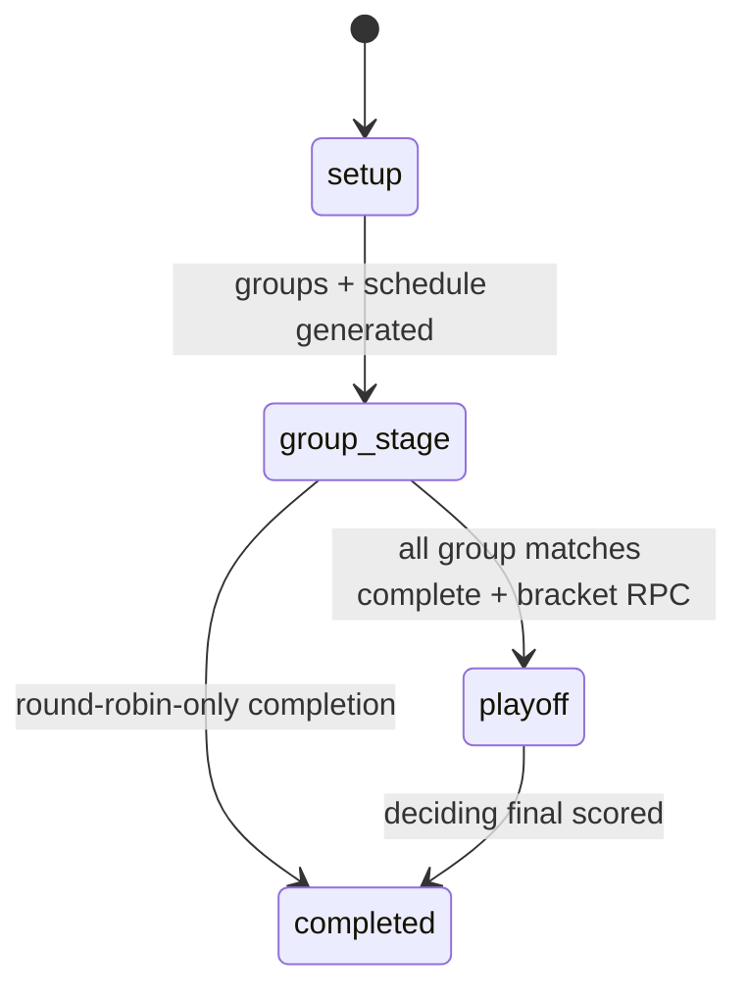
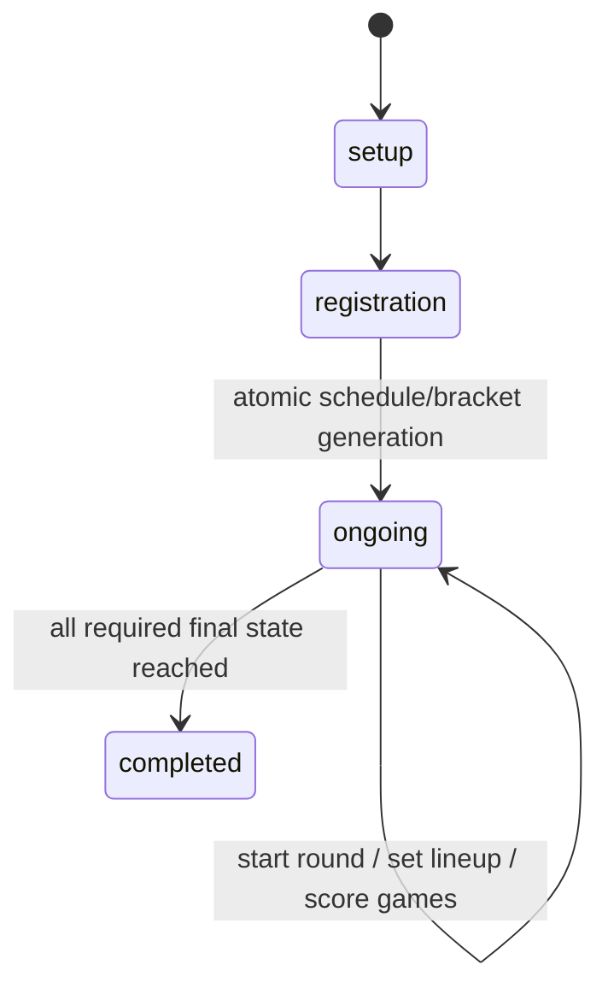
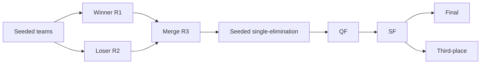
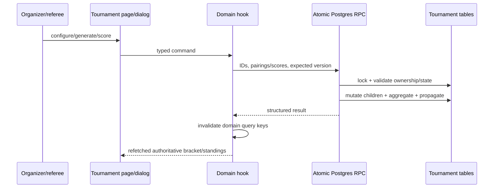

# Tournament engine

This project contains several related engines, not one polymorphic tournament model. Do not mix their tables or scoring APIs.

## Format map

| Engine | Formats/status | Core implementation |
|---|---|---|
| Quick Table | `round_robin`, `large_playoff`; `setup → group_stage → playoff → completed` | `useQuickTable.ts`, `useQuickTableMutations.ts`, `lib/round-robin.ts`, quick-table migrations |
| Team Match | `round_robin`, `single_elimination`, `rr_playoff`; `setup → registration → ongoing → completed` | `useTeamMatch*.ts`, `components/teamMatch/`, `20260722100000_atomic_team_match_lifecycle.sql` |
| Doubles Elimination | custom winner/loser/merge then single elimination; `setup → registration_open → ongoing → completed` | `useDoublesElimination.ts`, `lib/doubles-bracket-utils.ts`, `2026072202/04*` migrations |
| Flex | configurable player/team/group matches with parent-child matches and optional standings | `useFlexTournament.ts`, `components/flex/`, flex migrations |
| Social Event | organizer-generated event rounds/matches; registration/payment precedes play | `social_events`, `event_registrations`, `social_event_matches`, `useEventLive.ts` |
| Parent Tournament | aggregation of multiple quick tables and shared referee/overview operations | `useParentTournament.ts`, `ParentTournamentPage.tsx`, related RPCs |

## Common invariant

The browser may propose pairings/seeds, but authoritative lifecycle and score changes are atomic database RPCs. Current score RPCs take an expected `score_version`; stale writers receive conflicts. Winner calculation, match completion, standings, bracket propagation, and champion assignment happen in the same transaction. Never restore older direct `.update()` scoring paths.

## Quick Table

Quick tables support players or doubles teams, group splitting, circle-method round robin, court/time scheduling, referee assignment/PINs, and optional playoffs. `suggestGroupConfigs`, `distributePlayersToGroups`, and `generateCircleMethodMatches` are pure client algorithms; `create_quick_table_with_quota`, `score_quick_table_match_atomic`, and `create_quick_table_playoff_atomic` enforce creation/scoring/playoff transitions.

Group standings are derived from completed non-playoff matches. Ranking used by the playoff helpers is wins descending, point difference descending, then points for descending. The player model stores wins/losses, points for/against/difference, group seed, qualification, wildcard, playoff seed, and multi-round result fields (`useQuickTable.ts`). The playoff creator validates that group play is complete, qualifiers are unique/valid, first-round numbering is contiguous, and entrants are used correctly (`20260727120000_quick_table_champion.sql`). Scoring a playoff node advances its winner; completing the unique top-round final sets `champion_player_id` and completes the table.

Court scheduling preserves match rows/scores: `useQuickTableMutations.scheduleAllMatches` rewrites court, scheduled time, display order and round metadata rather than regenerating rows.

Two playoff seeding implementations coexist. `quick-table-playoff.ts` is the legacy six-group/16-slot path: six winners, six runners-up and up to four best third-place players, with BYEs. `quick-table-seeding-v2.ts` generalizes group count/advance count, uses standard seed-position layout, and resolves same-group first-round conflicts by reassigning only lower-half “floaters” so the bracket halves remain stable. Inspect the calling dialog before changing either; the older functions remain exported and tested.

## Team Match

A team-match tournament owns registered teams/rosters, game templates, group assignments, team-vs-team matches, and individual games. Match states are `pending`, `lineup`, `in_progress`, `completed`. Each game holds team lineups, score, winner, status, order, and `score_version` (`useTeamMatchMatches.ts`).

### Round robin and groups

`generate_team_match_round_robin_atomic` locks the tournament, validates approved teams/group configuration, is retry-idempotent, generates circle pairings/round numbers, and seeds games from templates. In `rr_playoff`, two to 26 groups are supported by the current RPC checks. `start_team_match_round_atomic` controls round activation.

`useTeamMatchStandings.ts` computes standings from completed, non-playoff matches that have a winner. The exact order is match wins descending, game differential descending, then point differential descending. The same comparator orders group qualifiers and wildcards; there is no head-to-head or random final tie-break in this hook, so a fully equal comparison preserves JavaScript's stable input order. Group setup uses `assign_team_match_teams_to_groups` (`GroupSetupDialog.tsx`).

### Match winner/scoring

`score_team_match_games_atomic` validates actor permission, locks requested games, checks each expected version, writes scores/winners, recomputes aggregate match result, and propagates a completed playoff winner to its destination. `total_score_mode` changes match resolution from games-won to accumulated-score behavior; it is carried from tournament settings into scoring UI and RPC logic.

### Elimination/playoffs

`generate_team_match_brackets_atomic` owns the full tree. The client passes named branches and selected first-round pairs. `single_elimination` can start directly from approved teams. `rr_playoff` requires round robin complete, then `generatePlayoffSeeding` selects main-bracket qualifiers. Optional `has_repechage` produces a second “repechage” branch, typically from lower group ranks; both branches are committed in one RPC call (`TeamMatchView.tsx`). Bracket rows store `is_playoff`, `is_repechage`, `playoff_round`, bracket position and destination links.

## Doubles Elimination

This is a project-specific staged double-elimination variant. Round types are `winner_r1`, `loser_r2`, `merge_r3`, then `elimination`, `quarterfinal`, `semifinal`, `third_place`, `final`; bracket types are `winner`, `loser`, `merged`, `single` (`useDoublesElimination.ts`). Match formats are BO1/BO3/BO5 by phase; `matchWinsNeeded` converts best-of count to required game wins.

Registration can enforce rating source/range (`self`, `dupr`, `either`). Seeding strategies are manual, deterministic random, or DUPR average. DUPR seeds preserve an `exact`/`approx`/`none` provenance. The atomic close RPC validates a full roster, assigns deterministic seeds, creates R1/R2/R3 nodes once, and transitions to ongoing (`20260722020000_atomic_doubles_registration_close.sql`).

`score_doubles_elimination_match_atomic` records score/version and routes winners/losers using JSON destinations. `advance_doubles_elimination_lifecycle` is idempotent: it assigns ranked R3 participants when prerequisites complete, then generates the seeded final playoff after the merge phase (`20260722040000_atomic_doubles_lifecycle.sql`). Ties in deterministic ranking use stable tournament-derived hashes, not runtime randomness.

## Flex engine

Flex tournaments model players, teams and membership separately, then assign either entities into groups (`flex_group_items`). Matches may point to a parent match; children represent submatches and the parent score is recomputed from child wins (`useFlexTournament.ts`). `counts_for_standings` allows exhibition/child matches to be excluded. Player and pair stat tables store group-level aggregates. Atomic RPCs score matches and update whether a match/group contributes to standings.

Round-robin generation exists per group. Because Flex deliberately supports heterogeneous configurations, do not assume all matches are simple two-player rows; resolve team members and parent/child semantics.

## Seeding and tie breakers

| Engine | Verified seeding/tie data |
|---|---|
| Quick Table | wins → point difference → points for; six-group legacy and generalized v2 seeding; playoff pairings supplied and server-validated |
| Team Match | match wins → game differential → point differential; playoff/repechage helpers consume this client order; DB validates bracket graph |
| Doubles | manual/random/DUPR initial seed; deterministic hash only as final stable tie breaker in lifecycle SQL |
| Flex | group item positions plus player/pair stats; match inclusion flag controls aggregates |

For Flex and doubles lifecycle ranking, read the latest RPC before changing tie behavior. For Quick Table and Team Match, the verified client comparators above are authoritative for displayed/seeding order but still rely on server validation for committed brackets.

## UI/data flow

## Rules that must not be broken

- Keep tournament families isolated; similarly named rows are not interchangeable.
- Preserve atomic RPC, lock, idempotency, and optimistic-version behavior.
- Generate a bracket only after its prerequisite registration/group phase.
- A client-calculated standing or winner is display/proposal data until the server commits it.
- Referee rights are server-derived; a visible scoring button is not authorization.
- Preserve bracket destination links and byes when editing generation code.
- Update generated types and both web/native contracts when migrations change public shapes.
