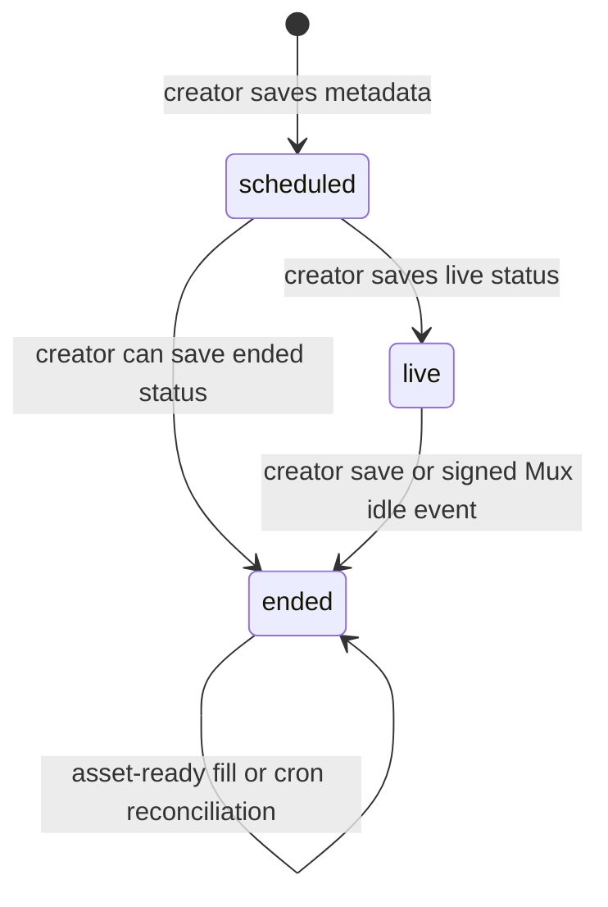

# Livestream architecture

## Model and states

`livestreams` is the writable base table; `public_livestreams` is the public view consumed by `useLivestreamData.ts`. The visible state values are `scheduled`, `live`, and `ended`, but the transition owner is split: the creator form can write all three states, while the current Mux webhook only performs `live → ended` on `video.live_stream.idle`. It does not set `live` on a connected/active event. Mux identifiers distinguish the live stream (`mux_live_stream_id`), live playback (`mux_playback_id`), secret ingest key (`mux_stream_key`), replay asset (`mux_asset_id`) and replay playback (`mux_asset_playback_id`).



## Creator workflow

`CreatorLivestreamForm.tsx` loads organization-scoped data through creator hooks, accepts title, description, tournament, schedule, thumbnail and status, then calls `mux-create-livestream` with the current bearer. The function role-checks creator/admin and calls Mux. It returns stream/live/playback credentials; the UI displays the RTMPS endpoint and masks the stream key for OBS configuration. Saving writes the database row and timestamps `started_at`/`ended_at` according to status. Creator list/edit/analytics screens are under `src/pages/creator/` and `src/hooks/useCreatorData.ts`.

Stream keys are ingest credentials: they must not appear in public views, logs, SEO, analytics, or share payloads.

## Mux reconciliation and replay

`mux-webhook` verifies a five-minute Mux HMAC/timestamp signature. It handles only `video.asset.ready` and `video.live_stream.idle`: asset-ready fills an empty replay asset without overwriting an existing/manual replacement; idle ends a row only when its current status is `live`. `mux-sync-assets` is cron-authenticated reconciliation over ended rows with missing playback or an `ended_at` inside a seven-day repair window. It preserves a stored asset if Mux says it is ready; otherwise it selects the longest ready item from `recent_asset_ids`. Ended playback prefers `mux_asset_playback_id`; live playback uses `mux_playback_id` (`WatchLive.tsx:166`).

```mermaid
sequenceDiagram
  participant OBS
  participant M as Mux
  participant W as mux-webhook
  participant DB as livestreams
  participant V as WatchLive
  OBS->>M: RTMPS + secret stream key
  C->>DB: explicitly save status=live, started_at
  V->>DB: read public_livestreams
  V->>M: play live playback ID
  M->>W: signed idle/asset-ready events
  W->>DB: live→ended; fill empty asset playback ID
  V->>M: play on-demand asset
```

## Viewer experience

`WatchLive.tsx` fetches one stream, total views, live related streams and ended replays. Scheduled streams show poster/time; live streams show live player, concurrent presence and total views; ended streams show replay, related streams, enhanced SEO, comments and sharing. A system setting can gate live/replay playback after a preview (`useLivestreamGate`, `LivestreamGateOverlay`); authenticated-state loading is respected to avoid pausing a valid user.

`useViewCount` is persistent aggregate data. `useIntervalViewCounter` batches watch intervals through `batch-view-events`. `useLivePresence` uses one shared/ref-counted fixed topic per livestream, unique per-tab presence keys, reconnect backoff, and excludes `admin_watcher_*` and `gated:true` entries from the displayed count. It runs only for live streams on `WatchLive`. Admin viewer inspection uses the same topic through `useLiveViewerList` and `AdminLivestreamViewers.tsx`.

## Chat and moderation

`ChatPanel` composes `useChatMessages`, nickname, likes, pins, mute and room controls. Messages are scoped by `livestream_id`, ordered by creation, and realtime-updated. `client_message_id` has a uniqueness index for retry idempotency. Moderation uses `can_moderate_chat`, mute/pin/highlight tables and admin/creator-derived privileges. Never authorize moderation from a client flag alone.

## SEO, sharing and embeds

`DynamicMeta`, `VideoSchema`, and `EndedLivestreamSEO` set canonical/title/description/VideoObject data. Ended titles emphasize replay; canonical URLs use `/livestream/:id`. Cloudflare crawler rendering lives in `functions/_lib/render/live-video.ts`; sitemaps are `functions/sitemap-livestreams.xml.ts`; OG images use `og-live`. `ShareDialog`, `/share/live/:id`, and `/embed/live/:id` provide platform sharing and stripped embeds. Public columns from the view are nullable and must be handled defensively.

## Failure modes

- Mux creation can fail from role, credentials, API or malformed body; do not persist a half-configured stream as playable.
- Webhooks can be duplicated/out of order; current fill-only/conditional updates and cron repair are deliberate and must remain replay-safe.
- Automatic `scheduled → live` transition is not implemented in the current webhook. A creator/operator must persist `live`; documentation or UI must not claim Mux does this automatically.
- An ended stream may temporarily lack an asset; render a safe poster/unavailable state until sync succeeds.
- Presence disconnect is not a persistent view decrement; presence and aggregate views answer different questions.
- Lazy chunk/network failure is handled by the app retry/boundary; do not add an infinite player reload loop.
