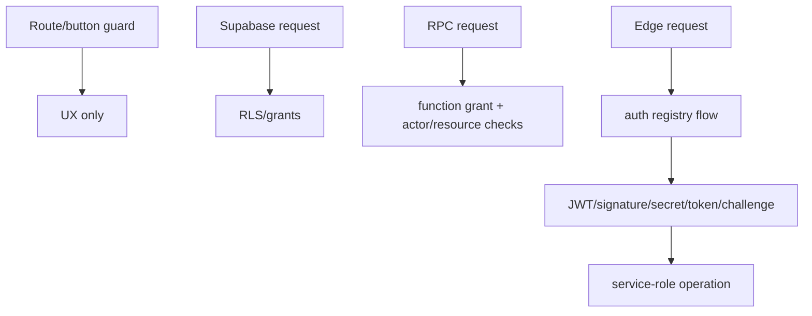

# Authentication and authorization

## Authentication

The web uses Supabase Auth through the singleton client. `AuthProvider` subscribes before calling `getSession`, exposes user/session/loading, and handles email/password sign-in/up/out. OAuth callback and reset routes are public. Native social login is initialized by `useNativeGoogleAuth`; deep-link callback handling is in `useDeepLinkHandler` and auth configuration helpers.

A `profiles` row is not necessarily an authenticated identity. Guest, pro-tour and invitation paths create `is_ghost=true` profiles without `auth.users` rows. Authenticated actor identity must come from the verified session, never merely from a profile ID.

On every `SIGNED_OUT`, React Query and auth-sensitive PWA caches are cleared (`useAuth.tsx`). Preserve this invariant to prevent one user seeing another user's cached RLS response on a shared device.

## Roles and permissions

| Actor | Representation | Typical permissions |
|---|---|---|
| anonymous | no session | public views/content, bounded telemetry/newsletter, magic-token/OTP flows |
| authenticated user | `auth.users` + `profiles` | own profile/social data, scoped matches/events/tools |
| creator | `user_roles.role=creator` plus organization association | organization videos/livestreams/tournaments |
| moderator | `user_roles.role=moderator` enum value | selected moderation policy paths; it is not treated as admin by `useAdminAuth` |
| admin | `user_roles.role=admin` | admin APIs/consoles; admin MFA gate for sensitive routes |
| organizer/captain/referee | resource relationship tables/RPC capability | scoped event/team/tournament operations |
| internal service/cron/provider | bearer/shared secret/signature | narrowly classified Edge Function flow |

`useAdminAuth` queries only `admin`. `useCreatorAuth` treats either `creator` or `admin` as creator-capable and separately reads `profiles.organization_id`. `RequireAuth` redirects unauthenticated users and optionally checks roles. Most admin pages use `AdminLayout`, which repeats the admin check and wraps content in `AdminMFAGate`; the exceptional direct routes use `RequireAuth requiredRole="admin"`. These are still not the server security boundary.

The generated enum also contains `viewer`; ordinary authenticated users do not need a `viewer` role row for most user features. Do not infer a complete permission lattice from enum ordering.

## RLS assumptions

Migrations enable RLS and define policies per table. Common predicates call helper functions such as `is_admin`, `has_role`, `is_creator`, tournament-specific creator/referee checks, club organizer/member checks, or compare `auth.uid()` with owner IDs. Public reads are often deliberately exposed via selected tables/views. Service-role Edge clients bypass all RLS; their request validation is therefore critical.

One deliberate exception needs special care: the latest `public_livestreams` migration uses owner/definer view semantics so anonymous reads bypass `livestreams` RLS. Its boundary is the explicit SELECT list, which currently omits `mux_stream_key`; do not describe it as invoker/RLS-filtered or add projected columns without a public-data review (`supabase/migrations/20260218031231_4d223ff8-f1aa-44e7-8607-c3c9d7523de3.sql`).

## Capability-based guest access

Guests use narrowly scoped secrets rather than accounts:

- `registration_secrets.magic_token` controls recovery/cancel/payment/score paths;
- phone OTP proves temporary control before registration;
- invitation codes bind a match/team invitation;
- referee PIN RPCs grant format/resource-scoped scoring capability.

Tokens must be looked up server-side, rate limited where applicable, never logged, and invalid outside their resource/lifecycle.

Ghost ownership transfer is hardened: `merge_my_ghost_by_phone` requires the requested phone to equal the caller's verified profile phone before invoking the service-only merge helper (`20260610120000_merge_ghost_phone_ownership.sql`). Knowing a guest's phone or name does not itself grant ownership.

## Security boundaries

Never trust request-body user IDs, organization IDs, role names, ownership booleans, or “admin” flags. Derive actor identity from `getUser()` and establish resource scope with database reads/RPCs. `supabase/functions/auth-registry.json` is machine-enforced and must be updated with any Edge Function change.
