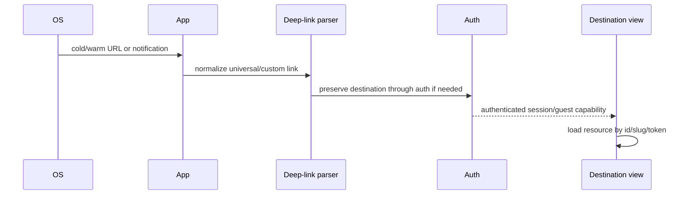

# Mobile architecture

## Two mobile clients

The repository has two distinct mobile approaches:

1. Capacitor 8 wraps the React web application (`capacitor.config.ts`, `android/`, `ios/`). Current production configuration loads the hosted site through `server.url`, not the local bundle as its primary content.
2. `apple/` is a native SwiftUI application with its own app shell, design system, repositories, models and tests (`apple/project.yml`, `apple/ThePickleHub/`).

Do not assume a React change automatically updates the SwiftUI client, or vice versa.

## Capacitor

The app id is `net.thepicklehub.app`, app name is ThePickleHub, and `webDir` is `dist`. More importantly, `server.url` is `https://www.thepicklehub.net`, with cleartext disabled and navigation allowlisted to ThePickleHub, Supabase, Mux and Google Accounts. This is remote-wrapper mode: the checked-in iOS public bundle can be stale relative to the hosted app, and the Android source tree in this snapshot is minimal (only public asset metadata and a network-security template are visible under `android/app/src/main`). Plugins configure Splash Screen, Status Bar and Capgo Social Login; App, Browser, Push and other Capacitor packages are dependencies used by hooks. PWA service-worker registration is skipped on native platforms (`src/pwa.ts`).

Universal/App Link setup is described in `capacitor.config.ts` comments and `MOBILE_BUILD_GUIDE.md`, but the complete Android manifest/project is not present in the current tracked snapshot, so Android filter correctness cannot be verified here. The Capacitor iOS artifact contains association files under its synchronized public tree and an `Info.plist.patch`; treat comments/templates as intended setup rather than proof of final signing/deployment.

## Native SwiftUI app

`apple/ThePickleHub/App/ThePickleHubApp.swift` is the composition root. `Features/Root` and `Features/Shell/AppTabView.swift` own session routing and tabs. Domain boundaries are explicit:

| Layer | Paths |
|---|---|
| App/composition | `App/`, `Features/Root/`, `Features/Shell/` |
| Feature views/models | `Features/Auth`, `Home`, `Live`, `Tournaments`, `Shop`, etc. |
| Data/domain repositories | `Core/Auth`, `Core/Live`, `Core/Tournament`, `Core/Shop`, etc. |
| Networking/Supabase | `Core/Networking`, `Core/Supabase` |
| Shared UI | `DesignSystem/`, `Core/Theme` |
| Resources/localization | `Resources/`, `Localizable.xcstrings` |

Repository protocols enable mocks in `apple/Tests/`; concrete Supabase repositories translate REST/RPC JSON into `Codable` models. Deep-link parsing is centralized in `Core/Networking/DeepLink.swift` and destination routing in registration/root features.

The native composition root also owns orientation locking (portrait by default, landscape for referee scoring, freer rotation for media), foreground/tapped notification routing, cold-launch deep-link buffering, Supabase session injection, Google Sign-In callback handling, localization bootstrap and The Line UI appearance (`ThePickleHubApp.swift`). `apple/project.yml` targets iOS 17, Swift 6, iPhone+iPad, and pins Supabase 2.48.0, GoogleSignIn 9.2.0 and Firebase 12.9.0.

## Native shop subsystem and contract status

The SwiftUI shop is not merely seller onboarding. `Core/Shop/` contains public catalogue/search DTOs, repositories, cache, cart, checkout/order/payment models and analytics; `Features/Shop/` contains home/search/category/product/store/wishlist/cart/checkout/order flows and shop design components. It calls `shop_public_*`, `shop_cart_*`, `shop_order_*` RPCs and `shop_cart_items`/`shop_orders` tables and constructs URLs for `shop-product-media`.

Those objects are not defined by any included migration/generated type in this repository snapshot. This means the native client is ahead of, or depends on, an external database contract. Future agents must verify the remote schema or add the missing canonical migrations under explicit authorization before assuming these screens work end to end.

## Lifecycle, links and push

Remote push setup is in `Core/Notifications/RemotePushService.swift`; web push is separately handled by the Capacitor hook and Supabase `push_tokens`. Universal links require hosted Apple association data and Android `assetlinks.json`; native signing identifiers must match hosted declarations.

## Mobile invariants

- Keep shared backend DTO/RPC semantics in sync across TypeScript and Swift.
- Do not enable service-worker caching inside Capacitor.
- Deep links must work for cold start, warm foreground, auth callback, and post-login continuation.
- Keep secrets out of xcconfig/plist and bundled web assets; only public client identifiers/anon keys may ship.
- Native repository errors should map transport/auth/decoding failures without silently inventing defaults.
- Because Capacitor uses a remote URL, distinguish a web rollback from an app-store binary rollback and verify native plugin availability for hosted code paths.
