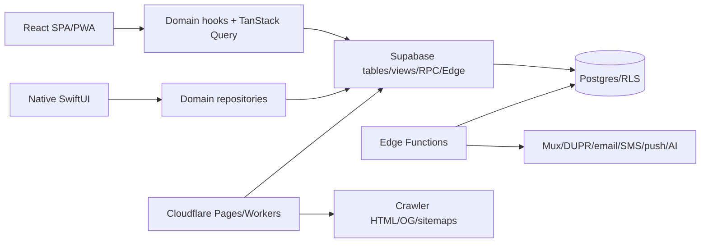

# AI quickstart

Read this document first, then the domain document relevant to your change. This repository is a bilingual pickleball platform with public media/discovery, social/club features, several independent tournament engines, creator/admin consoles, a Supabase backend, a Capacitor shell, and a separate native SwiftUI app.

## Mental model

The server is authoritative. React route guards and visible buttons are user experience, not security. Ordinary reads/writes go through RLS; concurrency-sensitive workflows go through atomic Postgres RPCs; external APIs and service-role access go through authenticated Edge Functions.

## Start here by task

| Task | Read | Inspect first |
|---|---|---|
| Any change | this file, `01_overview.md`, `11_coding_patterns.md` | `git status`, relevant tests |
| Route/page/UI | `02_frontend.md`, `15_file_index.md` | `src/App.tsx`, page, matching component/hook, route snapshot |
| Auth/admin/creator | `08_auth.md`, `12_security_review.md` | `RequireAuth`, auth hooks, RLS/RPC/Edge handler |
| Database/RPC | `03_backend.md`, `04_database.md` | latest matching migrations, generated types, callers |
| Edge Function | `05_edge_functions.md`, `12_security_review.md` | handler, `_shared`, `auth-registry.json`, config and tests |
| Tournament | `06_tournament_engine.md` | exact engine hook + latest atomic lifecycle/scoring SQL |
| Livestream/video/chat | `07_livestream.md` | watch/creator page, hooks, Mux functions, public view |
| Mobile | `09_mobile.md` | determine Capacitor versus `apple/` SwiftUI scope |
| Integration | `10_integrations.md` | all call sites and secret/config names |
| Performance | `13_performance.md` | bundle budget, RUM, query/realtime evidence |

## Repository map

- `src/pages/`: route screens.
- `src/components/<domain>/`: feature UI; `components/ui` is shadcn/Radix.
- `src/hooks/`: Supabase queries, mutations, contexts and feature orchestration.
- `src/lib/`: pure algorithms, policies and adapters.
- `src/integrations/supabase/`: typed browser clients and generated schema.
- `supabase/migrations/`: canonical schema, RLS, indexes, triggers and RPC history.
- `supabase/functions/`: Deno Edge handlers; `_shared` contains common security/integration code.
- `functions/`: Cloudflare Pages middleware, crawler renderers, OG proxies, sitemaps/RSS.
- `workers/`: independent Cloudflare jobs for news, pro tour, social posting and monitoring.
- `apple/`: separate native SwiftUI application.
- `android/`, `ios/`: Capacitor artifacts. Current config loads the hosted site; Android is minimal/incomplete here and iOS contains a stale synced bundle.
- `tests/`, colocated `__tests__`, `apple/Tests`: E2E/unit/native verification.

Ignore generated dependencies/build output (`node_modules`, `dist`, bundled native assets, reports) when inferring architecture.

## Web lifecycle

`src/main.tsx` initializes error/Web Vitals reporting, renders `App`, and conditionally registers the PWA. `App.tsx` constructs the Query Client and mounts providers: query → theme → i18n → auth → tooltip → confirm → browser router. Pages are lazy with one network retry; a chunk boundary clears stale service-worker caches with a reload cap. Most public routes are mirrored at `/vi`, and Cloudflare has a separate crawler-rendered HTML path.

Remote state belongs in TanStack Query. Auth/session is context. Short-lived dialog/form state is local React. Mutations invalidate stable domain query keys. Global query defaults avoid focus/mount refetch, use a 30-second stale window and bounded retries.

## Backend rules

1. `supabase/migrations/` is the truth. `types.ts` is generated output and may lag uncommitted migrations.
2. Search for the latest `CREATE OR REPLACE FUNCTION` definition; do not stop at the first migration hit.
3. Use RLS-aware browser clients for ordinary access. Never introduce the service role into client code.
4. Use atomic RPCs for multi-row lifecycle, quota, scoring and bracket work.
5. Validate expected `score_version` in score writes.
6. Edge gateway `verify_jwt=false` is common by design; the handler must verify the classified credential internally.
7. Update `supabase/functions/auth-registry.json` and its tests whenever a handler's auth flow changes.
8. Treat all `VITE_*` variables as public. All provider/service secrets are server-only.

Current schema warning: generated types contain 130 tables, five views, 201 RPCs and 26 enums but intentionally exclude the present shop-onboarding migration. React/Swift shop code also names product/media/cart/order contracts missing from included migrations. `product-import-enrich` names a missing generic `rate_limits` table. Never assume those objects exist from client code alone; verify remote schema or canonicalize them in a separately authorized database change.

## Tournament warning: there is no single engine

| Engine | Tables/hooks | Core invariant |
|---|---|---|
| Quick Table | `quick_table_*`, `useQuickTable*` | group play then optional validated playoff |
| Team Match | `team_match_*`, `useTeamMatch*` | a match aggregates configured games; supports RR, elimination, RR+playoff/repechage |
| Doubles Elimination | `doubles_elimination_*`, `useDoublesElimination` | custom R1/R2/R3 merge then seeded elimination |
| Flex | `flex_*`, `useFlexTournament` | heterogeneous players/teams/groups and parent-child matches |
| Social event matches | `social_event_matches`, event hooks | club-event workflow, not a tournament-engine substitute |

Never reuse a similarly named table/RPC across engines. Client algorithms may propose schedule/seeding, but database RPCs lock, validate, score, propagate and finalize. Preserve byes, destination links, expected versions and idempotency.

## Livestream model

Creators call `mux-create-livestream`, configure OBS with returned RTMPS/stream key, then save a `livestreams` row. The creator explicitly persists `live`; the current webhook does not activate a scheduled stream. It only changes a currently live row to ended on `idle` and fills an empty replay asset on `asset.ready`. Cron sync repairs recent ended streams and selects the longest ready Mux asset. Public pages read `public_livestreams`. Live uses `mux_playback_id`; replay uses `mux_asset_playback_id`. Presence reports concurrent viewers; view tables report persistent totals.

Never expose a Mux stream key. Handle ended streams without ready assets. Keep crawler metadata, sitemap, share and embed routes aligned with the user-facing page.

## Auth/security model

Supabase Auth establishes sessions. `user_roles` supplies admin/creator roles; organization ownership comes from profiles/resources. Organizer, captain, club manager/member and referee rights are resource relationships, not global roles. Guest event flows use magic tokens, OTPs, invitation codes or referee PINs as scoped capabilities.

Not every `profiles` row is a user: `is_ghost=true` rows represent guest/pro-tour/invited participants without `auth.users`. Avoid auth-user inner joins for participant displays. Ghost-to-real merging is phone-ownership hardened and must remain server-authorized.

For every write ask:

- Where is actor identity derived?
- Where is resource ownership/scope checked?
- Does RLS enforce it, or does a privileged RPC/Edge handler?
- Can the request be replayed, duplicated, raced or oversized?
- Could any token/secret enter logs, URLs, analytics or public views?

## Mobile decision

First determine the target:

- Capacitor is a remote WebView pointed at `https://www.thepicklehub.net`; plugin/config artifacts are in `capacitor.config.ts`, `android/`, `ios/`.
- The native Apple app is SwiftUI in `apple/`, with repository protocols, concrete Supabase repositories, feature views and separate tests.

A backend contract change can require TypeScript generated types, React hooks, Swift models/repositories and both test suites. Deep links must cover cold/warm launch and post-auth continuation. PWA service workers must remain disabled in Capacitor.

The native SwiftUI shop is substantially broader than the web pilot: catalogue/search, product/store, wishlist, cart, checkout and order/payment flows. Its named Supabase RPCs/tables/buckets are not represented by included migrations. Treat it as a client contract awaiting canonical backend evidence, not proof of an implemented database subsystem.

## Safe implementation workflow

1. Inspect `git status`; the worktree may contain unrelated user changes. Never overwrite them.
2. Read the relevant architecture file and source call chain from page → component → hook/repository → table/RPC/function → latest migration.
3. Identify all clients: web, crawler renderer, Capacitor behavior, SwiftUI, Workers.
4. Define the server authorization and transaction boundary before UI changes.
5. Make the smallest change within the existing domain pattern.
6. Regenerate/update schema contracts when a migration changes exposed types.
7. Update EN/VI routes/dictionaries and Cloudflare crawler/SEO maps for public pages.
8. Add focused unit/DB tests, then run relevant route/auth/schema/bundle/E2E gates in proportion to risk.
9. Recheck that no service secret, token or private row became client-visible.

Useful commands already defined by the project: `npm test`, `npm run lint`, `npm run build`, `npm run e2e:smoke`, `npm run drift`, and `npm run auth:registry`. Use focused tests first because the repository and worktree are large.

## Common pitfalls

- Editing an obsolete RPC definition instead of adding a later migration.
- Treating `RequireAuth` or an admin layout as authorization.
- Directly updating several score/bracket rows from the client.
- Losing query invalidation after a mutation.
- Forgetting `/vi`, canonical, crawler renderer, sitemap, OG or route snapshot parity.
- Assuming view columns are non-null because base-table columns are non-null.
- Confusing live presence with total views.
- Confusing organization, club, DUPR club and shop ownership.
- Assuming Capacitor and SwiftUI share UI code.
- Assuming the Capacitor local iOS public bundle is the runtime source; production config loads the hosted web app.
- Treating a registered Edge slug as implemented: `leaderboard-compute` and `notification-send` are skeletons.
- Treating hand-written shop types or Swift repository calls as proof that tables/RPCs/buckets exist.
- Adding a heavy import to `App.tsx` and defeating route splitting.
- Logging provider payloads that contain secrets or personal data.
- Editing compiled `dist`/native web assets instead of source and rebuilding.

## Things that must never be broken

- Server-side authorization/RLS and service-role isolation.
- Atomic, versioned tournament scoring and bracket propagation.
- Auth sign-out cache purge.
- Mux webhook signature and stream-key secrecy.
- Magic-token/OTP/PIN resource scoping and rate controls.
- EN/VI and crawler/user route canonical parity.
- Edge auth-registry completeness.
- Idempotency for webhooks, cron jobs, batch ingestion and retryable mutations.
- Backward-compatible deep links used by installed mobile clients and shared URLs.

## Documentation map

`01_overview` explains system topology; `02_frontend` React; `03_backend` Supabase boundaries; `04_database` entities; `05_edge_functions` every handler; `06_tournament_engine` algorithms/states; `07_livestream`; `08_auth`; `09_mobile`; `10_integrations`; `11_coding_patterns`; `12_security_review`; `13_performance`; `14_technical_debt`; `15_file_index`; `16_symbol_index`; `17_glossary`.
