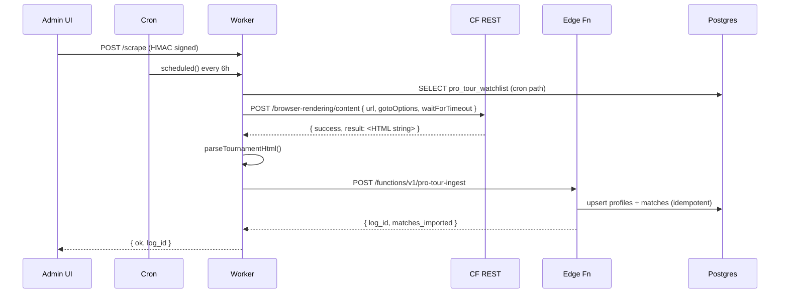

# pro-tour-scraper

Sprint 6 — Cloudflare Worker that scrapes pro-tour bracket pages
(brackets.pickleballtournaments.com) into the Supabase pipeline.

## Bindings + secrets

```bash
# One-time secret setup
wrangler secret put SUPABASE_SERVICE_ROLE_KEY
wrangler secret put SCRAPER_AUTH_SECRET
wrangler secret put CLOUDFLARE_API_TOKEN   # NEW: see token recipe below
```

Then edit `wrangler.toml` and set `CLOUDFLARE_ACCOUNT_ID` under `[vars]`
(the account that owns your Browser Rendering quota — find the id in
the URL of any page in the CF dashboard:
`https://dash.cloudflare.com/<account_id>/...`).

### Creating the `CLOUDFLARE_API_TOKEN`

1. CF dashboard → My Profile → API Tokens → Create Token → Custom token
2. Permissions: `Account` → `Browser Rendering` → `Edit`
3. Account Resources: include the account that hosts this Worker
4. Copy the token, paste into `wrangler secret put CLOUDFLARE_API_TOKEN`

The token only needs Browser Rendering scope — minimum-privilege so a
leak doesn't compromise other CF resources. Rotate via dashboard +
re-run `wrangler secret put` whenever needed.

### Why REST API instead of the puppeteer Workers binding

The previous approach used `@cloudflare/puppeteer` 0.0.14 with the
`MYBROWSER` Browser Rendering binding. It kept timing out on
`Browser.getVersion` at the launch handshake — the package doesn't
expose `protocolTimeout` via its `WorkersLaunchOptions` (only
`keep_alive`), so client-side cold-starts couldn't be tuned. The REST
API moves the browser lifecycle entirely to Cloudflare's side; we just
POST a URL and receive HTML, no client-side CDP timeout to hit.

Trade-off: REST `/content` is single-shot (no `actions`/click array
available as of 2026-05). The puppeteer path used to click each round
button (R32→F) so all five panels hydrated into the same dump. REST
only captures the initial server-rendered payload — typically Final +
Semis on a PPA bracket page (3 matches for an 8-team draw). Earlier
rounds are out of scope until we either (a) find a per-round URL
fragment, or (b) reintroduce the puppeteer binding behind a feature
flag. See `src/index.ts` header for the full discussion.

## Local dev

```bash
cd workers/pro-tour-scraper
npm install
npx wrangler dev    # local Worker, real Browser Rendering remote binding
```

Hit it manually:

```bash
BODY='{"tournament_url":"https://brackets.pickleballtournaments.com/tournaments/d7806c39-89b0-4692-970c-b73a835fa60a/events/1B71FDBD-3B56-41EF-A0D6-ADB38837896E/elimination/745D6E6E-5F00-4138-863B-B2BBB8153152","triggered_by":"manual"}'
SIG=$(echo -n "$BODY" | openssl dgst -sha256 -hmac "$SCRAPER_AUTH_SECRET" -hex | awk '{print $NF}')
curl -X POST http://localhost:8787/scrape \
  -H "Content-Type: application/json" \
  -H "X-Scraper-Signature: $SIG" \
  -d "$BODY"
```

Expected response shape:

```json
{
  "ok": true,
  "log_id": "<uuid>",
  "matches_extracted": 3,
  "players_extracted": 7
}
```

(Counts vary by tournament round depth + draw size; the values above are
from the men's doubles top-8 fixture in `__fixtures__/`.)

## Fixture harvest cycle

The parser is **not** DOM-selector based — it regex-extracts already-
structured match objects from the inline JSON that Next.js streams via
`self.__next_f.push([N, "..."])` script chunks. That makes the parser
immune to Tailwind class hash changes, dark-mode tweaks, and breakpoint
reflows. The shape we depend on is the platform's own server-side React
data contract, which can't change without breaking their UI.

Re-running the harvest cycle for a new tournament URL:

1. **Capture the post-hydration HTML.** Direct `curl` works for the
   initial server-rendered chunk (no Browser Rendering needed for parser
   verification):
   ```bash
   curl -sL -A 'Mozilla/5.0 (Macintosh)' \
     'https://brackets.pickleballtournaments.com/tournaments/<slug>/events/<UUID>/elimination/<UUID>' \
     -o /tmp/raw.html
   ```
   For full-bracket coverage the Worker's Browser Rendering path needs
   to click each round button so additional chunks stream in — that's
   orthogonal to the parser; once the chunks land in the page string,
   the same regex extractor picks them up.

2. **Save the fixture** to `workers/pro-tour-scraper/__fixtures__/<event-slug>.html`.
   These are committed (small enough — ~150KB per event). Public
   pro-player names + scores are NOT user-identifying data; do **not**
   capture admin or signed-in pages.

3. **Sanity-check the JSON shape.** A grep should find 3+ markers per
   round currently rendered:
   ```bash
   grep -c '"teams":' workers/pro-tour-scraper/__fixtures__/<file>.html
   ```
   If 0, the page didn't hydrate (auth wall, geo-block, or the platform
   changed their streaming format).

4. **Add fixture-based tests** to
   `src/lib/pro-tour/__tests__/rsc-scraper.test.ts`. Pattern: load the
   fixture file, call `parseTournamentHtml()`, assert `matches.length
   >= N`, verify spot-check player slugs + tournament name.

5. **Run vitest** from the project root until green:
   ```bash
   npx vitest run pro-tour
   ```

6. **If shape changed:** the platform may have renamed a key (e.g.
   `players` → `participants`). Update the regex constants at the top
   of `src/lib/pro-tour/adapters/rsc-scraper.ts`. The constants are
   commented with the byte sequence they're matching against — useful
   when reasoning about double-stringified JSON escape rules
   (JSON.stringify escapes `"` → `\"` but leaves `[` `]` bare).

## Deploy

```bash
cd workers/pro-tour-scraper
npx wrangler deploy
```

Deploys to `pro-tour-scraper.<account>.workers.dev`. Cron trigger
auto-registers (every 6h UTC).

## Architecture diagram



## Stage labels (for debugging failures)

When a scrape fails, the `error` field in the `/scrape` response and
the `pro_tour_ingestion_logs` row carries a `[stage] message` prefix
indicating which step died:

| Prefix | What it means |
|---|---|
| `[env-validate]` | `CLOUDFLARE_ACCOUNT_ID` or `CLOUDFLARE_API_TOKEN` missing |
| `[render-fetch]` | `fetch()` to CF REST API failed (network) or hit our 90s ceiling |
| `[render-http]` | CF REST returned non-2xx HTTP status |
| `[render-parse]` | CF REST returned 2xx but body wasn't a usable HTML envelope |
| `Ingest failed:` | HTML parsed OK, but Supabase edge function rejected the upsert |
