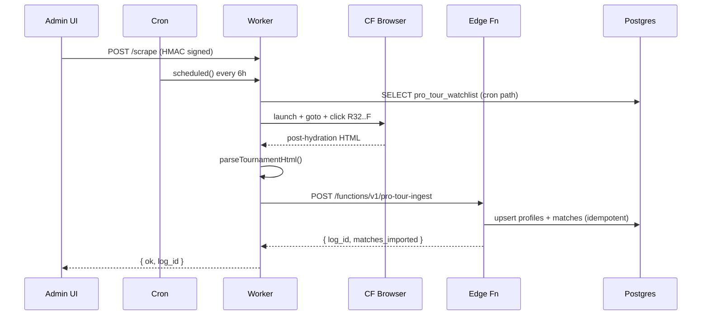

# pro-tour-scraper

Sprint 6 — Cloudflare Worker that scrapes pro-tour bracket pages
(brackets.pickleballtournaments.com) into the Supabase pipeline.

## Bindings + secrets

```bash
# One-time secret setup (Workers Paid plan, Browser Rendering enabled)
wrangler secret put SUPABASE_SERVICE_ROLE_KEY
wrangler secret put SCRAPER_AUTH_SECRET
```

`SUPABASE_URL`, `MYBROWSER` browser binding, and the cron schedule are in
`wrangler.toml` (committed). Service-role key + scraper auth secret are
sensitive and live only in CF dashboard / wrangler secrets.

## Local dev

```bash
cd workers/pro-tour-scraper
npm install
npx wrangler dev    # local Worker, real Browser Rendering remote binding
```

Hit it manually:

```bash
BODY='{"tournament_url":"https://brackets.pickleballtournaments.com/tournaments/d7806c39-89b0-4692-970c-b73a835fa60a/events/1B71FDBD-3B56-41EF-A0D6-ADB38837896E/elimination/745D6E6E-5F00-4138-863B-B2BBB8153152","triggered_by":"manual"}'
SIG=$(echo -n "$BODY" | openssl dgst -sha256 -hmac "$SCRAPER_AUTH_SECRET" -hex | awk '{print $NF}')
curl -X POST http://localhost:8787/scrape \
  -H "Content-Type: application/json" \
  -H "X-Scraper-Signature: $SIG" \
  -d "$BODY"
```

Expected response shape:

```json
{
  "ok": true,
  "log_id": "<uuid>",
  "matches_extracted": 0,
  "players_extracted": 7
}
```

`matches_extracted: 0` is **expected on the first run** — see the
"Selectors are scaffolding" note in `src/lib/pro-tour/adapters/rsc-scraper.ts`.
The end-to-end pipeline (Browser Rendering → parse → ingest function →
log row) runs successfully; the parser just doesn't surface any matches
until selectors are filled in against a captured fixture.

## Capturing the first fixture

After `wrangler dev` is running:

1. Hit `/scrape` with the test URL.
2. Worker tail shows the page HTML in dev. Save it to
   `__fixtures__/2026-ppa-finals.html` (gitignored binary; commit a
   small representative snippet only, the full page is multi-MB).
3. Open `src/lib/pro-tour/adapters/rsc-scraper.ts` and update each
   `SELECTOR_*` constant to match the actual class / data attribute
   strings in the captured DOM.
4. Run vitest against the fixture: `npm test parser` from the project root.
5. Iterate until the expected match count parses.

## Deploy

```bash
cd workers/pro-tour-scraper
npx wrangler deploy
```

Deploys to `pro-tour-scraper.<account>.workers.dev`. Cron trigger
auto-registers (every 6h UTC).

## Architecture diagram


